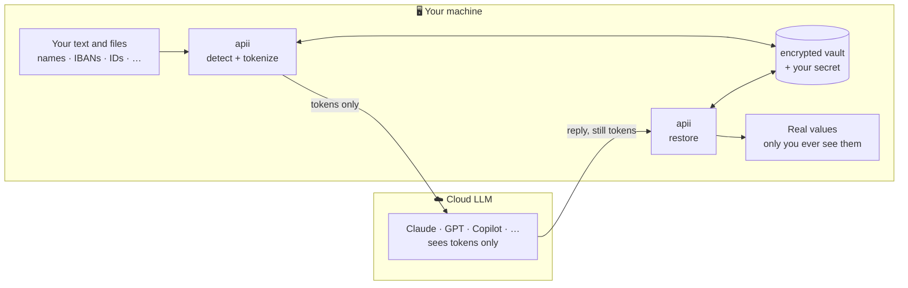
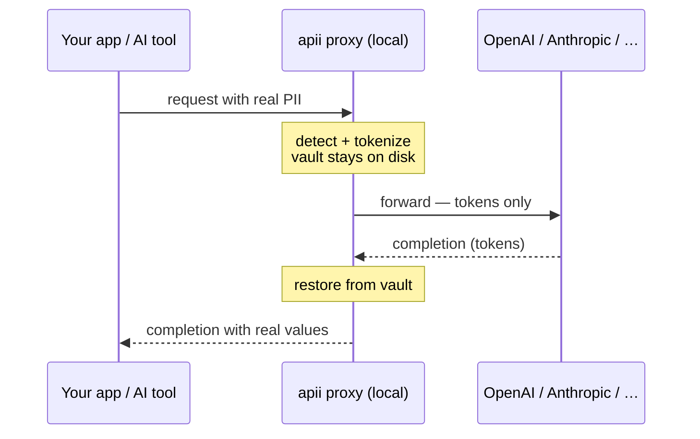

# apii

[](https://pypi.org/project/apii/) [](https://pypi.org/project/apii/) [](#license)

**Use AI on Arabic and Gulf documents without handing over the personal data.**

`apii` is a local privacy layer. It finds the sensitive data in your text — names, national IDs, IBANs, phone numbers, addresses, VAT and commercial-registration numbers, organizations, emails — and replaces each value with a reversible token *before* anything reaches an AI model. The model only ever works on tokens; the real values stay encrypted on your machine and are restored locally when the reply comes back.

```bash
pip install "apii[all]"
```



Only tokens ever cross to the model. The single network call `apii` makes is a one-time, optional model download — point it at your own copy and it runs fully offline, forever.

> ▶ **Try it in your browser:** the [live playground](https://huggingface.co/spaces/aajil-labs-sa/apii-demo) — paste text and watch PII tokenize and restore, nothing to install. *(Or run it locally: `python demo/server.py`.)*

---

## Why apii exists

Teams across the Gulf — banks, fintechs, telcos, government, healthcare — increasingly *cannot* send customer data to a US-hosted model, for legal and contractual reasons. `apii` is how you keep using Claude, GPT, Copilot, or your AI coding tools on that work anyway: the PII never leaves your machine, and the model sees only placeholders like `EMAIL_C7E2…`.

It's built for Arabic, not adapted to it — it reads Arabic names, Arabic-Indic digits (`٠٥٠…`), and right-to-left text that English-first tools silently drop, and it **validates** structured identifiers (IBAN by ISO-7064 MOD-97, national IDs by check digit) instead of trusting a pattern that merely looks right.

- 🌍 **Arabic + English**, all six GCC countries — names, IDs, IBANs, phones, VAT, CR, addresses
- 🔒 **Local by default** — no service to run, no account, nothing uploaded
- 🪶 **Light** — pure Python, no PyTorch; NER runs as an int8 ONNX graph
- 🔁 **Reversible & consistent** — the same value always maps to the same token, and only your secret turns it back

---

## Install

`apii[all]` is the whole tool — CLI, on-device NER, the proxy, and document support. Embedding `apii` as a library instead? Stay lean and add only what you touch.

| install | adds |
|---|---|
| `pip install apii` | core detection (regex + checksums) and the `apii` CLI |
| `pip install "apii[ner]"` | on-device PERSON / ORGANIZATION detection |
| `pip install "apii[cli]"` | encrypted-vault persistence (`--vault`) |
| `pip install "apii[proxy]"` | the streaming `apii serve` gateway |
| `pip install "apii[documents]"` | PDF extraction (CSV / JSON / HTML / DOCX / XLSX are built in) |
| `pip install "apii[all]"` | everything above |

Requires Python 3.10+. The NER models (~210 MB, int8 ONNX) download once from Hugging Face and cache locally; without them every structured kind still works — only PERSON and ORGANIZATION need a model.

---

## Quickstart

```bash
# detect + tokenize; the token↔value map is saved to an encrypted vault
echo "Email omar@aajil.sa, IBAN SA0380000000608010167519" | apii redact --vault demo.vault
# → Email EMAIL_180AC17DC476B40B, IBAN IBAN_BA6B8757242BA7BB

# hand the tokens to any model, then restore its reply
apii restore reply.txt --vault demo.vault
```

Tokens are deterministic, so the same person keeps the same token across a document — the model can reason about "the same customer" without ever learning who they are.

---

## Use it with your AI tools

One engine, four ways in. Pick whichever fits how you work.

### Proxy — in front of any API

Run one local gateway and point any client's base URL at it. `apii` tokenizes the request, forwards only tokens upstream, and restores the (streamed) reply — your client and your API key are untouched.

```bash
apii serve     # → http://127.0.0.1:8720   (--host / --port to change)
```



One port speaks three wire formats — OpenAI Chat, OpenAI Responses (what Codex uses), and Anthropic Messages — so it fronts OpenAI, Anthropic, Codex, and anything OpenAI-compatible (OpenRouter, LiteLLM, Together, vLLM…). Choose the upstream with `APII_OPENAI_BASE` / `APII_ANTHROPIC_BASE`.

| your client | point it at |
|---|---|
| OpenAI SDK / chat apps | `base_url = http://127.0.0.1:8720/v1` |
| Codex CLI (Responses API) | a model-provider with `base_url = …:8720/v1`, `wire_api = "responses"` |
| Claude Code / Anthropic SDK | `ANTHROPIC_BASE_URL = http://127.0.0.1:8720` |
| OpenRouter / LiteLLM / any OpenAI-compatible | the OpenAI base URL above, with `APII_OPENAI_BASE=<provider>` |

```bash
# route OpenAI-style traffic through OpenRouter, PII-safe:
APII_OPENAI_BASE=https://openrouter.ai/api/v1 apii serve
```

Every route is verified end-to-end — streaming and non-streaming — against a live provider and the real Codex CLI.

### Claude Code — the transparent hook

`apii install-claude-hook` wires two hooks into Claude Code, then `apii watch` shows you the decoded side:

| hook | what it does |
|---|---|
| redact-on-read | tokenizes PII in a file before the model reads it — Claude only ever sees tokens |
| restore-on-write | turns tokens back into real values before bytes hit disk — your files come out correct |

It's non-blocking: you work normally, the model just never receives PII. Run `apii watch` in a second pane to read Claude's replies with the real values restored, locally.

### Agent skill — for any coding agent

[`skills/apii/SKILL.md`](skills/apii/SKILL.md) is the portable [Agent Skills](https://agentskills.io) format. Drop it into Claude Code, Codex, or Cursor and the agent learns to redact and restore on its own:

```bash
cp -r skills/apii ~/.claude/skills/     # or .claude/skills/ for a single project
```

### CLI, batch, library, and UI

```bash
apii detect notes.txt                                                        # audit only — detections as JSON
apii redact-dir ./statements --out-dir ./masked --ext csv --vault s.vault    # whole folders, layout preserved
apii ui                                                                      # paste-in / paste-out page at :8765
```

```python
from apii.anonymizer import Anonymizer
a = Anonymizer(secret="…", tenant="acme")
r = a.anonymize("Email omar@aajil.sa, IBAN SA0380000000608010167519")
send_to_llm(r.text)                      # the model sees tokens
show_user(a.deanonymize(model_reply))    # restored locally
```

**Which one?** They stack — use as many as you like:

| | what it is | reach for it when |
|---|---|---|
| **Skill** | teaches an agent to redact / restore deliberately | the agent drives; works in any tool; zero setup |
| **Hook** | automatic redact-on-read + restore-on-write | you want it enforced and invisible — Claude Code |
| **Proxy** | a hard transport boundary the provider can't see past | you don't control the client, or want it provider-wide |

---

## What it detects

| kind | how it's found |
|---|---|
| `EMAIL` | format |
| `PHONE` | GCC country codes, Saudi 05X, international shapes |
| `IBAN` | ISO-7064 MOD-97 checksum (all six GCC countries) |
| `TAX_NUMBER` | 15-digit Saudi / GCC VAT |
| `COMMERCIAL_REGISTRATION` | 10-digit CR, label-cued |
| `NATIONAL_ID` | UAE-784 / Saudi Iqama / GCC, check-digit validated |
| `PERSON` | on-device NER (no name lists) |
| `ORGANIZATION` | on-device NER |
| `ADDRESS` | PO-box / street patterns + NER locations |

Quality is measured against a 1,340-span corpus of real, publicly-sourced values in `tests/eval/` (`pytest tests/python -q` runs it). Structured IDs are checksum-validated, so a number that merely looks like an IBAN doesn't survive.

Out of scope by design: API keys, payment-card numbers, and free-form internal codes — redacting those reliably needs context `apii` doesn't claim to have.

---

## How it works

`apii` keeps two boundaries apart:

- **Privacy boundary** — what the model receives: only tokens, always.
- **Display boundary** — what you see: real values, because the data is yours and never leaves your machine.

The bridge between them is a local, encrypted vault (`~/.apii/default.vault`, ChaCha20-Poly1305) and a secret (`~/.apii/secret`, `chmod 600`). Each token is `HMAC-SHA256(secret, value)` — deterministic, and irreversible without your secret. Restoration happens at the last mile (your screen, your files) and never re-enters the model's context.

---

## Reference

### Commands

| command | what it does |
|---|---|
| `apii redact [file]` | Anonymize text (stdin or a file) → stdout; save the token↔value map to `--vault`. |
| `apii restore [file] --vault V` | Reverse it: tokens → real values, from the vault. |
| `apii detect [file]` | Audit mode — list detections as JSON, change nothing. |
| `apii scan-dir DIR --out F` | Detect across a folder; write per-file JSONL summaries + totals. |
| `apii redact-dir DIR --out-dir D` | Redact every matching file (format-aware) into `--out-dir`, merging records into one `--vault`. |
| `apii serve` | Local anonymizing LLM proxy — `/v1/messages`, `/v1/chat/completions`, `/v1/responses` (needs `[proxy]`). |
| `apii ui` | Local paste-in / paste-out web UI (`127.0.0.1:8765`). |
| `apii install-claude-hook` | Wire redact-on-read + restore-on-write into Claude Code (`--global` for all projects). |
| `apii watch` | Tail the current folder's Claude session, restoring tokens for your screen. `--once` dumps it so far. |
| `apii hook` / `apii daemon` / `apii hook-client` | The per-event hook, an optional hot daemon, and a thin bridge to it. |

Common flags: `--secret` (or `$APII_SECRET`), `--tenant`, `--vault`, `--policy strict|balanced|audit`, `--no-ner`. Run `apii <cmd> --help` for the rest.

### Environment

| variable | purpose |
|---|---|
| `APII_SECRET` | Vault HMAC / encryption key. Falls back to the managed `~/.apii/secret` (auto-created, `chmod 600`). |
| `APII_HOME` | Config + vault directory (default `~/.apii`). |
| `APII_POLICY` | Default policy: `strict` (default) / `balanced` / `audit`. |
| `APII_NER_THRESHOLD` | NER minimum confidence (default `0.85`). |
| `APII_NER_CASE_AUG` | Lowercase-name recovery: `auto` (default) / `always` / `off`. |
| `APII_NER_MODEL` / `APII_NER_EN_MODEL` | Use your own local Arabic / English ONNX model directories. |
| `APII_NER_HF_REPO` | Hugging Face repo to fetch models from (default `aajil-labs-sa/arabic-pii-ner`). |
| `APII_NER_NO_DOWNLOAD` | Disable the model auto-download (fully offline). |
| `APII_OPENAI_BASE` / `APII_ANTHROPIC_BASE` | Upstream targets for `apii serve`. |
| `APII_SUPPRESS_PHRASES` | Path to a phrase file of vocabulary to never tokenize. |
| `APII_GEO_GAZETTEER` | Path to an optional gazetteer for address detection. |

---

## NER models & credit

The bundled models are int8-ONNX redistributions of two open models — **please keep crediting the original authors**:

- **Arabic** — [`hatmimoha/arabic-ner`](https://huggingface.co/hatmimoha/arabic-ner) by Hatim Mohamed, on [`asafaya/bert-base-arabic`](https://huggingface.co/asafaya/bert-base-arabic) by Ali Safaya.
- **English** — [`dslim/bert-base-NER`](https://huggingface.co/dslim/bert-base-NER) by David S. Lim (MIT, CoNLL-2003).

Hosted (quantized, with full provenance + SHAs) at [`aajil-labs-sa/arabic-pii-ner`](https://huggingface.co/aajil-labs-sa/arabic-pii-ner).

---

## Make it yours

`apii` is a self-contained Python package under a permissive license — yours to run, fork, self-host, and extend, privately or commercially. No server to depend on, no account to create.

- Tune detection in `apii/recognizers/` — a regex, a checksum, a new country shape.
- Swap the NER models with `APII_NER_MODEL` / `APII_NER_EN_MODEL`, or point `APII_NER_HF_REPO` at your own repo.
- Run fully offline: bring the models locally and set `APII_NER_NO_DOWNLOAD=1`.

Contributions are welcome — open an issue or a pull request. A real miss on real (de-identified) data is the most useful thing you can send: the recognizers are checksum- and context-driven, not a fixed list, so misses are exactly what sharpens them.

---

## Contact

Questions, feedback, security reports, or partnership inquiries — **labs@aajil.sa**. For bugs and feature requests, a [GitHub issue](https://github.com/Aajil-Labs/arabic-pii-py/issues) is fastest.

---

## License

© Aajil Labs. Dual-licensed — your choice of **MIT** *or* **Apache-2.0** (see `LICENSE-MIT` and `LICENSE-APACHE`). You may use, modify, and redistribute this software, including privately and commercially, under either license; keep the copyright and license notices in copies. The bundled NER models are redistributed under their original authors' terms — credit them as above.
